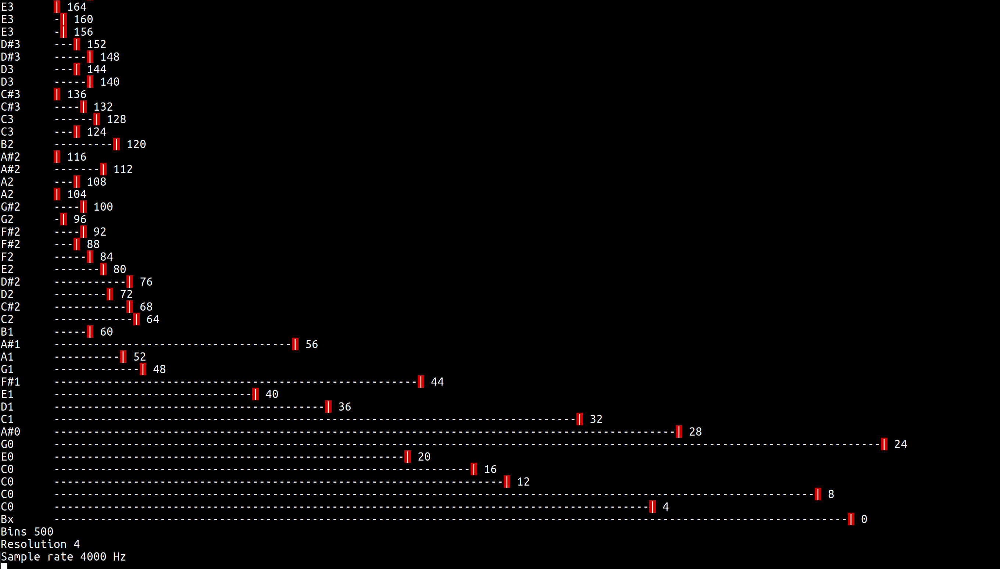

Command line Fourier analysis and spectrum analyser written in C++ with no
third-party libraries. See [Fourier transform on
Wikipedia](https://en.wikipedia.org/wiki/Fourier_transform#Example).

# Build and run
```bash
$ make noise
```



# Coding standard and linter
There's a make rule to run ```cppcheck``` and one to run ```clang-format```
over all cpp and h files with the default settings and apply the results. It
would be nice if this were more integrated into the workflow. And it can be
useful to swap in ```iwyu``` to weed out any left over includes. But I don't
really like the output so it's used purely as a guide.
```bash
make CC=iwyu
```

# Optimisation
I've instrumented the code and switched between compiler optimisation settings
(none or three) during development.

## Observations
C arrays are marginally quicker than vectors.

Calling reserve with a vector is quicker than a C array.

The twiddle array is the most computationally expensive procedure.

Only half of the twiddle array is needed.

Aim for the compiler to do as much as possible up front: optimise away the
calculation.

Using floats for all the calculations is slower than doubles.

Creating the array offline results in a very quick twiddle calculation but it
takes a long time to compile and both clang and gcc cough for large arrays. The
build procedure is also becoming very complicated.

Hardcoding the bin count halves the twiddle calculation before compiler
optimisation.
